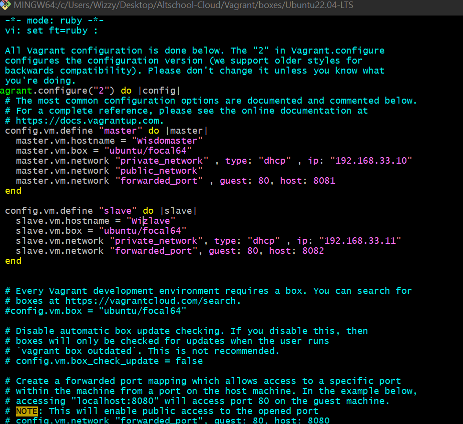

## Steps Taken
> Step 1  
I set up the both master and slave servers by using Vagrant by modifying a Vagrantfile with the following configuration:

> Step 2  
Wrote a bash script for LAMP stack deployment on the Master node Create a bash script named **winners.sh**

Purpose:

This script automates the process of setting up a Laravel application on a Linux system with Apache web server and a MySQL database.  

> After successful running of script  

> Step 3  
Create an Ansible playbook to execute the bash script on the Slave node Create an Ansible playbook named **playbook.yml**

]

> Step 4  
Verifying the IP address on my web browser to successfully show laravel installation  

